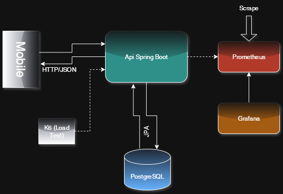
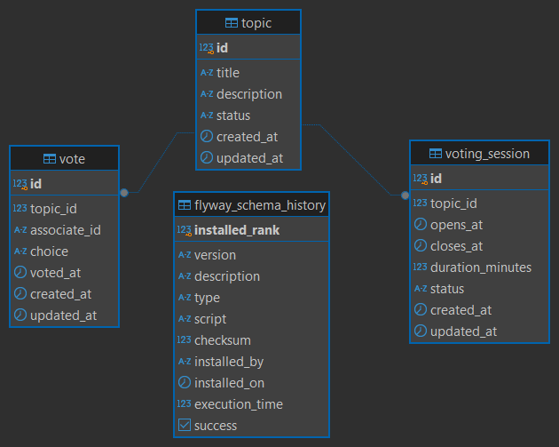
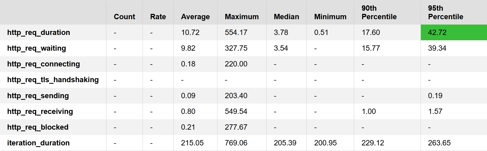

# Desafio de Votação (Sicredi) 🗳️

[](https://github.com/Gilberto491/DesafioVotacao/actions)
[](#execução-com-docker)

## 📌 Apresentação do Desafio
Solução para gestão de sessões de votação em cooperativismo:
- Cada associado vota uma única vez por pauta (Sim/Não).
- Ao votar, pode haver retorno aleatório de erro: **`UNABLE_TO_VOTE`**.
- O **CPF** informado passa por verificação de validade antes de registrar o voto.
- Abertura de sessões com duração configurável (default 1 minuto).
- Contabilização de votos e apuração do resultado.

> **Objetivo:** expor uma API REST escalável, observável e preparada para cloud.

---

## 🧰 Tecnologias e Ferramentas
- **Linguagem/Framework:** Java 17, Spring Boot (Web, Data JPA, Validation, Actuator)
- **Banco:** H2 (dev/test), PostgreSQL (prod)
- **Migração:** Flyway
- **Build/Testes:** Maven, JUnit 5, Mockito
- **Observabilidade:** Prometheus, Grafana, API (health)
- **Performance:** k6
- **Container/Orquestração:** Docker/Podman + Docker Compose
- **Docs:** OpenAPI/Swagger
- **Cache:** Redis

## 🌐 URLs Online
- 📊 **API Base:** <a href="http://34.59.158.212:8080/api/v1/topics" target="_blank">API Base</a>
- 📑 **Swagger UI:** <a href="http://34.59.158.212:8080/swagger-ui/index.html" target="_blank">Swagger UI</a>
- 📈 **Prometheus:** <a href="http://34.59.158.212:9090" target="_blank">Prometheus</a>
- 📊 **Grafana:** <a href="http://34.59.158.212:3000" target="_blank">Grafana</a></li>

## 🗂️ Versionamento

- O projeto adota versionamento semântico (**Semantic Versioning**), onde o versão final release foi fechado em **1.0.0**.  
- A **API** também possui versão definida no seu **path base** (`/api/v1`), o que garante compatibilidade e facilita futuras evoluções.  
- Essa configuração é centralizada na classe `ApiConstants`, permitindo alterar a versão em **apenas um local** para refletir em toda a aplicação:

```
public class ApiConstants {
    private ApiConstants() { throw new IllegalStateException("Utility class"); }

    public static final String BASE = "/api/v1";
}
```

## 🔗 Endpoints da API

### 📂 Topic
- `POST /api/v1/topics` — Create Topic
- `GET /api/v1/topics` — List Topics
- `GET /api/v1/topics/{id}` — Topic By Id
- `DELETE /api/v1/topics/{id}` — Delete Topic

### 📂 Session
- `POST /api/v1/topics/{topicId}/sessions` — Create Session

### 📂 Vote
- `GET /api/v1/topics/{topicId}/sessions/check-open` — Check Open
- `GET /api/v1/sessions/{sessionId}/open-now` — Open Now  
- `POST /api/v1/sessions/{sessionId}/votes` — Vote Topic
- `GET /api/v1/sessions/{sessionId}/votes/count` — Count Vote

  > **Detalhes completos:** consulte o Swagger.

  ## ✨ Diferenciais do Projeto
- **Migrations com Flyway** (versionadas e idempotentes)
- **Mensagens em `messages.properties`** (i18n de erros/validações)
- **Padrão de logs** (correlação, níveis e formatação para observabilidade)
- **Actuator + Métricas** expostas para Prometheus
- **Testes**: unidade e integração (controllers/services/repos)
- **Pipeline CI**: build, testes e versões com tags
- **Redis**: cache em ponto crucial do sistema

---

## 🏗 Arquitetura e Modelagem

<p align="center">
  
  &nbsp;&nbsp;&nbsp;
  
</p>

**Arquitetura do Sistema**  
> A arquitetura foi construída utilizando **Spring Boot** como API principal, integrada ao banco **PostgreSQL**, monitorada com **Prometheus** e **Grafana**, além de testes de carga com **K6**.

**Modelagem do Banco de Dados**  
> A modelagem reflete as entidades principais do sistema de votação, incluindo pautas, sessões de votação e votos, estruturadas para manter integridade e escalabilidade.

## 🧪 Testes de Performance

<p align="center">
  
  &nbsp;&nbsp;&nbsp;
  
</p>

Os testes de performance foram realizados nos dois **endpoints críticos do sistema**:
- **Criação de pauta** (`/topics`)
- **Registro de votos** (`/votes`)

> Os cenários de carga foram executados com o **K6**, simulando múltiplos usuários concorrentes.  
> Obtivemos **ótimos resultados**, com tempos de resposta estáveis e sem falhas significativas, conforme mostrado nas métricas acima.

### ✅ Testes automatizados
```bash
k6 run vote-session.js \
  -e BASE_URL=http://localhost:8080 \
  -e SESSION_ID=1 \
  -e VUS=500 \
  -e DURATION=1m
```

KPIs principais analisados:

- http_req_duration → tempo médio das requisições

- checks → porcentagem de checks que passaram

- http_req_failed → taxa de falhas de requisições

# 🔁 Fluxos de teste (essenciais)

### 1) Happy path – criar pauta, abrir sessão e votar
1. **POST** `/topics` → cria pauta  
2. **POST** `/topics/{topicId}/sessions` → abre sessão para a pauta  
3. **POST** `/sessions/{sessionId}/votes` → registra voto  
4. **GET** `/sessions/{sessionId}/votes/count` → confere resultado  

_Status esperados:_ `201, 201, 201/200, 200`

---

### 2) Voto duplicado (regra de negócio)
1. Criar pauta → abrir sessão → votar 1ª vez (OK)  
2. **POST** `/sessions/{sessionId}/votes` novamente com o mesmo CPF → deve falhar  

_Status esperado:_ `409`

---

### 3) Sessão expirada
1. Criar pauta → abrir sessão com tempo curto  
2. Tentar votar após expiração  
3. **POST** `/sessions/{sessionId}/votes` → deve falhar  

_Status esperado:_ `422`

---

### 4) Consultas e limpeza (sanidade)
1. **GET** `/topics` → lista todas as pautas  
2. **GET** `/topics/{id}` → detalhe de uma pauta  
3. **DEL** `/topics/{id}` → remove pauta (quando permitido pela regra)  

_Status esperados:_ `200, 200, 204`

---

## 📖 Swagger (API Docs)

A aplicação conta com documentação interativa via Swagger, disponível em:

- **Local**:    [Swagger Local](http://localhost:8080/swagger-ui/index.html)
- **Ambiente**: [Swagger Ambiente](http://34.59.158.212:8080/swagger-ui/index.html)

⚠️ **Importante**  
- Como a parte de **segurança foi abstraída**, não é possível realizar chamadas diretamente pelo Swagger no ambiente remoto devido a restrições de **CORS**.  
- No ambiente **local**, o Swagger funciona normalmente tanto para documentação quanto para chamadas.  
- No ambiente de **deploy**, o Swagger deve ser usado **apenas como documentação**.

---

  ## 🎯 Tarefas Bônus
- [x] **Validação externa de CPF** (mockado para efeito do desafio)
- [x] **Observabilidade** com Prometheus + Grafana
- [x] **Pipeline CI/CD** com GitHub Actions
- [x] **Migrations com Flyway** para versionamento do schema
- [x] **Mensagens em arquivo properties** (i18n de erros e validações)
- [x] **Testes de performance com k6** (rodados em ambiente local)
- [x] **Controle de versão** (através de tags)
- [x] **Índices no banco de dados** para ganho de performance em consultas  
- [x] **Cache com Redis** para otimizar a listagem de tópicos em cenários com grande volume de dados  

> ⚠️ Os testes de carga foram executados **localmente**. O ambiente de VM na nuvem utiliza plano *free*, sujeito a restrições de disco e desempenho, podendo causar lentidão não relacionada ao código da aplicação.

---

## 📂 Estrutura do Projeto

```
desafio-votacao/
│── .github/workflows/
│── k6-performance/
│── postman/
│── sicredi/
│ ├── src/main/java/com/sicredi/desafio/
│ │ ├── controller/
│ │ ├── service/
│ │ ├── repository/
│ │ ├── domain/
│ │ ├── dto/ 
│ │ └── config/ 
│ └── src/test/java/com/sicredi/desafio/
│ ├── controller/
│ ├── service/
│ └── repository/
│── docker-compose.yml
│── pom.xml
│── README.md
```

> Além das pastas principais, o projeto conta também com assembler, constants, exception, external, helpers e mapper, que dão suporte à organização e boas práticas no código (separação de responsabilidades, centralização de mensagens e utilitários, integração com sistemas externos e mapeamentos automáticos).


## ⚡ Cache

Para otimizar a performance da aplicação e reduzir o tempo de resposta em cenários de grande volume de dados, foi implementado **cache** na **listagem de tópicos**.  

A ideia é que, em situações onde há muitas pautas cadastradas, o cache evite consultas repetidas ao banco de dados, entregando resultados de forma mais rápida e eficiente.  

Sempre que um novo tópico é criado ou deletado, o cache é automaticamente atualizado, garantindo consistência entre os dados armazenados e os retornados pela API.

## 🔒 Políticas e Regras de Negócio
- Cada associado pode **votar apenas uma vez por pauta**.  
- Uma sessão só pode ser aberta se a pauta não possuir outra sessão ativa.  
- Ao encerrar, a sessão muda status para **USED** e não pode ser reaberta.  
- Resultados contabilizam todos os votos válidos (`YES` / `NO`).
- O **CPF** informado passa por verificação de validade antes de registrar o voto.
- Ao votar, pode haver retorno aleatório de erro: **`UNABLE_TO_VOTE`**.

## 🌱 Fluxo Git

Este projeto segue um fluxo baseado no **Git Flow** simplificado:

- **develop**: utilizada para desenvolvimento contínuo, onde novas features e correções são integradas.
- **release/x.y.z**: criada a partir da `develop` para estabilização de uma versão antes de ir para produção.  
  Exemplo: `release/1.0.0`.
- **main**: contém apenas versões estáveis, correspondendo ao que está em produção.

🔖 As versões estáveis são marcadas com **tags** (ex.: `v0.1.0`, `v0.1.1`, `v1.0.0`) e utilizadas para gerar **releases** no GitHub.

---

## ▶️ Como Executar o Projeto (Local/Container/Cloud)

### 🚀 Local (sem containers)
```
# Pré-requisitos: Java 17 + Maven + PostgreSQL + redis + Grafana/Prometheus (Opcional)

git clone https://github.com/Gilberto491/DesafioVotacao.git
cd desafio-votacao/sicredi
mvn spring-boot:run
```

### 🐳 Com Docker/Podman
```
git clone https://github.com/Gilberto491/DesafioVotacao.git
cd desafio-votacao/sicredi
docker-compose up -d
```

## 🚀 Futuras Melhorias
- Autenticação com **JWT** para segurança
- Pipeline CI/CD completo com deploy automatizado
- Integração com **SonarQube/SonarCloud**: análise estática e cobertura
- Armazenamento de artefatos em repositório **Nexus**
  
---

- ## 👤 Contribuidores / Autor
- **Junior Fredes**  
  - 💼 [LinkedIn](https://www.linkedin.com/in/gilbertofredes/)  
  - 💻 [GitHub](https://github.com/gilberto491)  
